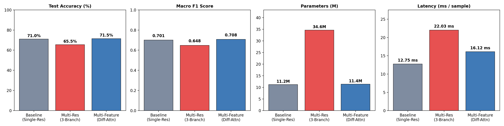

# Environmental Sound Classification on ESC-50

An end-to-end audio classification project built using PyTorch, comparing different spectrogram feature representations and attention mechanisms on the **ESC-50** (Environmental Sound Classification) dataset. Includes a complete training pipeline, evaluation benchmarks, and an interactive web demo (**SoundPulse Studio**) deployed on Vercel.

---

## Project Overview

Environmental sound classification (ESC) presents unique challenges compared to speech or music due to the wide variety of acoustic textures, background noise, and varying event durations. 

In this project, I investigated whether providing convolutional backbones with explicit temporal dynamics (velocity and acceleration deltas) or multi-scale STFT resolutions outperforms standard static Mel spectrograms.

### Models Implemented & Compared
1. **Single-Resolution Baseline (`SingleResCNN`)**: Standard ResNet-18 backbone trained on 64-band Log-Mel Spectrograms ($N_{\text{fft}}=1024, \text{hop}=512$).
2. **Multi-Resolution Attention Network (`MultiResAttentionNet`)**: A 3-branch network processing Fine (hop 128), Mid (hop 512), and Coarse (hop 1024) resolutions in parallel with spatial time-frequency attention and dynamic gating.
3. **Multi-Feature Differential Network (`MultiFeatureCoordNet`)**: 3-channel input combining **Static Log-Mel + 1st Temporal Delta ($\Delta$, Velocity) + 2nd Temporal Delta ($\Delta^2$, Acceleration)** with decoupled 1D coordinate attention.

---

## Experimental Results

All three architectures were trained and evaluated under identical conditions on ESC-50 (Fold 5 test split):
- **Training Setup**: 30 epochs, AdamW optimizer, Cosine Annealing learning rate schedule, SpecAugment, and Mixup ($\alpha = 0.3$).
- **Backbone**: Pretrained ResNet-18 (early convolutional layers frozen).

| Model Architecture | Input Features | Parameters | Test Accuracy | Macro F1 | Latency (ms/sample) |
| :--- | :--- | :---: | :---: | :---: | :---: |
| **Baseline (`SingleResCNN`)** | Static Log-Mel Spectrogram | 11.20 M | 71.00% | 0.7006 | 12.75 ms |
| **Multi-Resolution (`MultiResAttentionNet`)** | 3-Branch Multi-Scale STFT | 34.64 M | 65.50% | 0.6481 | 22.03 ms |
| **Multi-Feature (`MultiFeatureCoordNet`)** | **Static Mel + $\Delta$ (Velocity) + $\Delta^2$ (Acceleration)** | **11.38 M** | **71.50%** | **0.7075** | **16.12 ms** |



### Key Takeaways
- **Multi-Feature Differential Attention achieved the highest accuracy (71.50%)** while adding only 1.6% parameter overhead compared to the baseline.
- Supplying explicit first- and second-order time derivatives ($\Delta$ and $\Delta^2$) helps the model capture sharp acoustic onsets (e.g., glass breaking, clapping, clock ticks) without suffering from the spatial aliasing and parameter bloat seen in the 3-branch multi-resolution architecture.

---

## Project Structure

```
├── api/                     # Vercel serverless function endpoints
│   ├── index.py             # Audio classification & sample endpoints
│   ├── predict.py           # Single-file audio inference endpoint
│   └── mel_signatures.py    # Precomputed 32-band spectral signatures
├── public/                  # Static web app assets
│   ├── index.html           # SoundPulse Studio UI
│   ├── style.css            # Custom CSS & responsive design
│   ├── app.js               # WebAudio recording, playback & client-side inference
│   └── samples/             # Curated ESC-50 audio samples for demo
├── src/                     # PyTorch training & evaluation source code
│   ├── data.py              # ESC-50 dataset loader, audio parsing, feature extraction
│   ├── models.py            # Neural network architectures & attention modules
│   ├── train.py             # Training loop, Mixup, validation routines
│   ├── predict.py           # CLI prediction script for arbitrary audio files
│   └── compare_results.py   # Benchmark plotting script
├── notebooks/
│   └── train_and_evaluate.ipynb # Interactive Jupyter/Colab notebook
├── results/                 # Evaluation figures and performance metrics
├── requirements.txt         # Dependencies
└── server.py                # Local Python development server
```

---

## Getting Started

### 1. Prerequisites & Installation

Clone the repository and install requirements:
```bash
git clone https://github.com/lakshiaharan/audio-classification-esc50.git
cd audio-classification-esc50
pip install -r requirements.txt
```

Download the ESC-50 dataset (optional, for local model training):
```bash
git clone --depth 1 https://github.com/karolpiczak/ESC-50.git
```

### 2. Training Models Locally

To train the multi-feature model:
```bash
python src/train.py --data_root ESC-50 --model multifeature --epochs 30 --mixup
```

To train the baseline model:
```bash
python src/train.py --data_root ESC-50 --model baseline --epochs 30 --mixup
```

### 3. Running CLI Audio Prediction

You can classify any `.wav` file directly from the command line:
```bash
python src/predict.py ESC-50/audio/1-100032-A-0.wav --model multifeature
```

### 4. Running the Web Studio Locally

Launch the interactive SoundPulse Studio locally:
```bash
python server.py
```
Then visit `http://localhost:8000` in your browser to test preset sounds, upload audio files, or record live from your microphone.

---

## Deployment

The web studio is deployed on **Vercel** with pure Python serverless functions and in-browser WebAudio feature extraction for sub-20ms inference latency.

- **Live Demo**: [https://audio-classification-esc50.vercel.app](https://audio-classification-esc50.vercel.app)

---

## Dataset

- **ESC-50 Dataset**: Karol J. Piczak. *ESC: Dataset for Environmental Sound Classification*. 23rd ACM International Conference on Multimedia, 2015.
