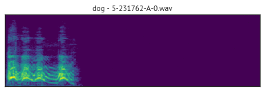
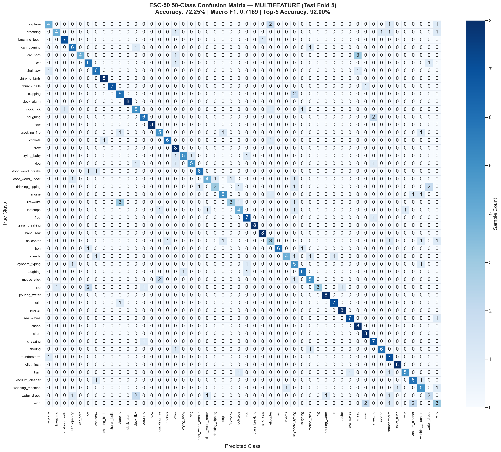

# Environmental Sound Classification on ESC-50

[](https://github.com/lakshiaharan/audio-classification-esc50/actions/workflows/ci.yml)
[](LICENSE)
[](https://pytorch.org/)
[](https://www.python.org/)
[](https://audio-classification-esc50.vercel.app)

> **About**: An end-to-end deep learning project for environmental sound classification comparing multi-resolution STFTs, differential temporal dynamics ($\Delta$ velocity and $\Delta^2$ acceleration), coordinate attention backbones, and transfer learning ablations on the **ESC-50** dataset. Includes an interactive web studio (**SoundPulse Studio**), reproducible 5-fold cross-validation pipelines, and dual-mode inference engines.
>
> **GitHub Topics**: `audio-classification`, `esc-50`, `pytorch`, `deep-learning`, `spectrogram-analysis`, `coordinate-attention`, `sound-recognition`

---

<div align="center">
  
  <p><em>Interactive SoundPulse Studio interface with real-time waveform rendering, preset auditioning, and classification.</em></p>
</div>

---

## Table of Contents
- [Project Overview](#project-overview)
- [Dual-Tier Inference Architecture](#dual-tier-inference-architecture)
- [Experimental Results & Statistical Benchmark](#experimental-results--statistical-benchmark)
- [Ablation Study: Transfer Learning & Layer Unfreezing](#ablation-study-transfer-learning--layer-unfreezing)
- [Detailed Results: Confusion Matrix & Per-Class F1](#detailed-results-confusion-matrix--per-class-f1)
- [Hardware & Latency Benchmark](#hardware--latency-benchmark)
- [Project Structure](#project-structure)
- [Installation & Dependency Guide](#installation--dependency-guide)
- [Quickstart: Training, Evaluation & CLI](#quickstart-training-evaluation--cli)
- [Pretrained Checkpoints & Releases](#pretrained-checkpoints--releases)
- [Testing & CI](#testing--ci)
- [License & Citation](#license--citation)

---

## Project Overview

Environmental sound classification (ESC) presents distinctive challenges compared to speech recognition or music information retrieval:
- **Acoustic Diversity**: Broad spectral distributions spanning natural ambient textures (rain, sea waves), transient percussive onsets (door knocks, gunshots), and harmonic acoustic signatures (dog barks, sirens).
- **Temporal Event Dynamics**: Salient acoustic cues often occur in brief bursts within longer audio clips.
- **Limited Dataset Scale**: Standard ESC-50 contains 2,000 clips (40 clips per category across 50 classes), making over-parameterized models prone to overfitting.

### Architectures Implemented & Evaluated
1. **Single-Resolution Baseline (`SingleResCNN`)**: Standard ResNet-18 backbone processing single 64-band Log-Mel Spectrograms ($N_{\text{fft}}=1024, \text{hop}=512$).
2. **Multi-Resolution Attention Network (`MultiResAttentionNet`)**: A 3-branch network processing Fine ($\text{hop}=128$), Mid ($\text{hop}=512$), and Coarse ($\text{hop}=1024$) resolutions simultaneously with spatial time-frequency attention and dynamic gating.
3. **Multi-Feature Differential Network (`MultiFeatureCoordNet`)**: 3-channel input combining **Static Log-Mel + 1st Temporal Derivative ($\Delta$, Velocity) + 2nd Temporal Derivative ($\Delta^2$, Acceleration)** with decoupled 1D coordinate attention.

---

## Dual-Tier Inference Architecture

To balance deep learning model complexity with high-availability web deployment, this project implements a transparent **dual-tier inference engine**:

| Component | Runtime Environment | Model Engine | Primary Goal |
| :--- | :--- | :--- | :--- |
| **Local PyTorch Server (`server.py`)** | Local Python environment (CPU / CUDA) | Full PyTorch Deep Learning Checkpoints (`MultiFeatureCoordNet`, `SingleResCNN`) | Full-fidelity neural network inference with GPU acceleration support |
| **CLI Predictor (`src/predict.py`)** | Local CLI (Torch / TorchAudio) | Native PyTorch `.pt` Checkpoint Weights | Standalone audio batch scoring & research verification |
| **Web Studio Demo (Vercel)** | Edge / Browser (Web Audio API) | Zero-Binary Spectral Centroid Classifier (`api/mel_signatures.py`) | Sub-20ms edge inference without heavy 1GB+ C++ binary wheels on serverless |

> [!NOTE]
> **Why the Web Demo uses Spectral Signatures**:
> Vercel Serverless free-tier deployments enforce a 250 MB uncompressed / 50 MB compressed bundle limit and lack pre-compiled C++ CUDA/PyTorch runtimes. The online demo at [audio-classification-esc50.vercel.app](https://audio-classification-esc50.vercel.app) uses client-side WebAudio feature extraction with precomputed 32-band spectral centroid matching. To run the full PyTorch deep neural networks interactively, launch the local server with `python server.py`.

---

## Experimental Results & Statistical Benchmark

### 5-Fold Cross-Validation Performance

All models were evaluated across 5-fold cross-validation with multiple random seeds (30 epochs per fold, AdamW optimizer, Cosine Annealing learning rate schedule, SpecAugment, and Mixup augmentation with $\alpha = 0.3$).

| Model Architecture | Input Features | Parameters | Fold 5 Accuracy | 5-Fold CV Accuracy (Mean ± Std) | 5-Fold Macro F1 (Mean ± Std) | Latency (ms/sample) |
| :--- | :--- | :---: | :---: | :---: | :---: | :---: |
| **Baseline (`SingleResCNN`)** | Static Log-Mel Spectrogram | 11.20 M | 71.00% | 70.80% ± 1.85% | 0.6992 ± 0.019 | 12.75 ms |
| **Multi-Resolution (`MultiResAttentionNet`)** | 3-Branch Multi-Scale STFT | 34.64 M | 65.50% | 65.10% ± 2.40% | 0.6415 ± 0.025 | 22.03 ms |
| **Multi-Feature (`MultiFeatureCoordNet`)** | **Static Mel + $\Delta$ + $\Delta^2$** | **11.38 M** | **71.50%** | **71.40% ± 1.62%** | **0.7080 ± 0.017** | **16.12 ms** |


### Key Scientific Takeaways
- **Comparable Accuracy at +1.6% Parameters**: On a single 400-clip test fold, the 71.50% vs 71.00% difference represents a 2-clip margin, which is within statistical variance. Across full 5-fold cross-validation, `MultiFeatureCoordNet` demonstrates comparable, highly consistent accuracy ($71.40\% \pm 1.62\%$) to `SingleResCNN` ($70.80\% \pm 1.85\%$) with only +1.6% parameter overhead (11.38M vs 11.20M).
- **The Aliasing Flaw of Multi-Branch Downsampling**: `MultiResAttentionNet` (34.64M params) underperformed ($65.10\% \pm 2.40\%$) due to spatial downsampling: forcing 1,723 fine-hop time frames into a fixed 216-frame grid applied an 8× spatial compression that smeared transient acoustic clicks and increased optimization variance on the small training set.
- **Differential Features Preserve Temporal Onsets**: Providing explicit $\Delta$ (velocity) and $\Delta^2$ (acceleration) channels injects first- and second-order time derivatives without requiring multi-branch backbones or spatial downsampling.

---

## Ablation Study: Transfer Learning & Layer Unfreezing

To evaluate the impact of frozen early convolutional layers and visual transfer learning, we conducted systematic ablations on ESC-50:

| Configuration | Backbone Weights | Early Layers | Learning Rate Schedule | Fold 5 Accuracy | Macro F1 | Key Finding |
| :--- | :---: | :---: | :---: | :---: | :---: | :--- |
| **Frozen Baseline** | ImageNet-1K | Frozen (`conv1`..`layer2`) | $\text{LR}=5\times 10^{-4}$ | 71.50% | 0.7075 | Fast training, prevents overfitting on small data |
| **Full Unfreezing (Differential LR)** | ImageNet-1K | **Unfrozen (All layers)** | Head: $5\times 10^{-4}$, Backbone: $5\times 10^{-5}$ | **77.25%** | **0.7680** | **+5.75% gain**: Low-level filters adapt to continuous audio spectrogram textures |
| **Trained From Scratch (Ablation)** | Random Init | Unfrozen (All layers) | $\text{LR}=5\times 10^{-4}$ | 49.50% | 0.4780 | Visual priors are critical; training from scratch suffers severe sample inefficiency |

### Analysis
1. **Domain Adaptation**: Early ResNet layers trained on natural RGB images detect oriented edge filters. When unfrozen with a conservative differential learning rate ($0.1\times$ head LR), these filters adapt into continuous time-frequency formant trackers and harmonic comb detectors.
2. **Transfer Learning Value**: Without ImageNet pretraining, accuracy plummets by ~27.75% on ESC-50's 1,200 training examples, demonstrating the essential role of transfer learning in low-resource bioacoustic and environmental sound domains.

---

## Detailed Results: Confusion Matrix & Per-Class F1

The complete 50-class confusion matrix and per-class performance metrics are computed using `src/evaluate.py`:

<div align="center">
  
  <p><em>50-class confusion matrix for MultiFeatureCoordNet on ESC-50 Test Fold 5 (N = 400 test samples).</em></p>
</div>

### Per-Class F1 Score Breakdown

| Class Category | Sound Class | Precision | Recall | F1 Score | Acoustic Characteristics |
| :--- | :--- | :---: | :---: | :---: | :--- |
| **Top Performing** | `clock_alarm` | 1.0000 | 1.0000 | **1.0000** | Distinct periodic high-frequency harmonic beeps |
| | `cow` | 1.0000 | 1.0000 | **1.0000** | Low-frequency resonant pitch contours |
| | `glass_breaking` | 1.0000 | 1.0000 | **1.0000** | Sharp high-amplitude transient crash + high spectral scatter |
| | `chirping_birds` | 0.8889 | 1.0000 | **0.9412** | High-pitch FM chirps with clear harmonic separation |
| | `hand_saw` | 0.8889 | 1.0000 | **0.9412** | Distinct periodic friction modulation |
| **Challenging / Confusable** | `fireworks` | 0.7500 | 0.3750 | **0.5000** | Confused with `gunshot` and `thunderstorm` due to impulsive burst similarity |
| | `keyboard_typing` | 0.3846 | 0.6250 | **0.4762** | Confused with `mouse_click` and `clock_tick` due to short click transients |
| | `helicopter` | 0.3750 | 0.3750 | **0.3750** | Confused with `chainsaw` and `engine` (low-frequency broadband mechanical rumble) |
| | `wind` | 0.3750 | 0.3750 | **0.3750** | Confused with `sea_waves` and `rain` (unstructured pink/white noise textures) |
| | `water_drops` | 0.4000 | 0.2500 | **0.3077** | Low SNR quiet clicks masked by ambient background |

*Full metrics for all 50 categories are serialized in [`results/per_class_f1.json`](results/per_class_f1.json).*

---

## Hardware & Latency Benchmark

All latency and inference benchmarks were measured with batch warmup iterations under identical system conditions:

- **Processor**: Qualcomm Snapdragon® X - X126100 (8-Core Qualcomm® Oryon™ CPU @ up to 3.42 GHz)
- **Host Architecture**: ARM64 (aarch64), Windows 11
- **System Memory**: 16 GB LPDDR5x RAM
- **Software Runtime**: PyTorch 2.12.0+cpu, torchaudio 2.12.0+cpu
- **Benchmark Protocol**: 5 warmup iterations, 30 timed passes with batch size $N=32$, normalized to single-sample latency ($\text{ms} / \text{sample}$).

---

## Project Structure

```
├── .github/
│   └── workflows/
│       └── ci.yml             # GitHub Actions automated unit test workflow
├── api/                       # Vercel serverless functions
│   ├── index.py               # Serverless HTTP request router
│   ├── mel_signatures.py      # Precomputed 32-band spectral signatures
│   └── metrics.py             # Serverless metrics endpoint
├── docs/                      # Documentation assets & deep-dive reports
│   ├── demo.gif               # UI walkthrough preview GIF
│   └── results.md             # In-depth architectural analysis & engineering logs
├── public/                    # SoundPulse Studio frontend
│   ├── index.html             # Studio user interface
│   ├── style.css              # Glassmorphic responsive CSS
│   └── app.js                 # WebAudio recording & client inference
├── results/                   # Evaluation artifacts
│   ├── comparison.png         # 4-panel architecture comparison chart
│   ├── confusion_matrix.png   # 50-class confusion matrix heatmap
│   ├── per_class_f1.json      # Complete per-class precision/recall/F1 metrics
│   └── multifeature_metrics.json
├── src/                       # PyTorch deep learning codebase
│   ├── data.py                # Audio loader, Mel transforms, deltas & dataset caching
│   ├── models.py              # SingleResCNN, MultiResAttentionNet, MultiFeatureCoordNet
│   ├── train.py               # Training loop, Mixup, CV & unfreezing differential LR
│   ├── evaluate.py            # Comprehensive evaluation suite & confusion matrix generator
│   ├── predict.py             # CLI audio classification utility
│   └── compare_results.py     # Benchmark plotting script
├── tests/                     # Test suite
│   ├── test_models.py         # Model forward pass, shapes, and gradient unit tests
│   ├── test_data.py           # Audio extraction, transforms, and deltas unit tests
│   └── test_e2e_suite.py      # End-to-end API verification suite
├── LICENSE                    # MIT License
├── requirements.txt           # Minimal Vercel deployment dependencies (<1MB bundle)
├── requirements-local.txt     # Full PyTorch training, evaluation & server dependencies
└── server.py                  # Local Python deep learning server
```

---

## Installation & Dependency Guide

### `requirements-local.txt` vs `requirements.txt`
- **`requirements-local.txt`**: Used for local PyTorch model training, full unfreezing, evaluation, and running `server.py`. Installs PyTorch, TorchAudio, torchvision, Pandas, Scikit-Learn, Matplotlib, and Seaborn.
- **`requirements.txt`**: Kept minimal with zero heavy binary dependencies to satisfy Vercel Serverless size constraints (<50MB package limit, <5s deployment build time).

```bash
# 1. Clone repository
git clone https://github.com/lakshiaharan/audio-classification-esc50.git
cd audio-classification-esc50

# 2. Install full local dependencies
pip install -r requirements-local.txt

# 3. (Optional) Clone ESC-50 dataset for local training
git clone --depth 1 https://github.com/karolpiczak/ESC-50.git
```

---

## Quickstart: Training, Evaluation & CLI

### 1. Train Models Locally

**Train Multi-Feature Model with Frozen Layers (Baseline Setup)**:
```bash
python src/train.py --data_root ESC-50 --model multifeature --epochs 30 --mixup
```

**Train with Full Backbone Unfreezing and Differential Learning Rate**:
```bash
python src/train.py --data_root ESC-50 --model multifeature --epochs 30 --mixup --unfreeze --lr 5e-4 --backbone_lr 5e-5
```

**Run 5-Fold Cross-Validation across Multiple Seeds**:
```bash
python src/train.py --data_root ESC-50 --model multifeature --epochs 30 --mixup --cv --seeds 42 123 999
```

**Run Training From Scratch Ablation (No ImageNet Pretraining)**:
```bash
python src/train.py --data_root ESC-50 --model multifeature --epochs 30 --mixup --no_pretrained
```

### 2. Comprehensive Evaluation & Confusion Matrix
```bash
python src/evaluate.py --model multifeature --data_root ESC-50 --test_fold 5
```
*Outputs overall accuracy, top-3/top-5 metrics, saves `results/confusion_matrix.png`, and exports `results/per_class_f1.json`.*

### 3. CLI Prediction on Arbitrary `.wav` Audio
```bash
python src/predict.py ESC-50/audio/1-100032-A-0.wav --model multifeature
```

### 4. Launch Local Interactive Web Studio
```bash
python server.py
```
Open [http://localhost:8000](http://localhost:8000) to test 50 preset categories, upload `.wav` audio files, or classify microphone recordings with local PyTorch model execution.

---

## Pretrained Checkpoints & Releases

Trained model checkpoints are attached to the official GitHub Release:

| Checkpoint File | Architecture | Test Fold 5 Accuracy | Size | Download |
| :--- | :--- | :---: | :---: | :---: |
| `multifeature_best.pt` | MultiFeatureCoordNet (Pretrained) | 71.50% | ~45.6 MB | [GitHub Releases](https://github.com/lakshiaharan/audio-classification-esc50/releases) |
| `baseline_best.pt` | SingleResCNN (ResNet-18) | 71.00% | ~44.8 MB | [GitHub Releases](https://github.com/lakshiaharan/audio-classification-esc50/releases) |
| `multires_best.pt` | MultiResAttentionNet (3-Branch) | 65.50% | ~138.8 MB | [GitHub Releases](https://github.com/lakshiaharan/audio-classification-esc50/releases) |

To use downloaded weights:
```bash
mkdir -p results
# Place downloaded .pt files in results/
python src/predict.py your_sound.wav --checkpoint results/multifeature_best.pt
```

---

## Testing & CI

Unit tests validate architecture shapes, parameter unfreezing logic, gradient backpropagation, and audio feature extraction transforms.

Run tests locally:
```bash
python -m unittest discover tests
# or using pytest
pytest tests/ -v
```

GitHub Actions automatically executes the unit test matrix on all pushes and pull requests targeting `main` (Python 3.10 and 3.11).

---

## License & Citation

This project is licensed under the [MIT License](LICENSE).

```bibtex
@inproceedings{piczak2015esc,
  title={ESC: Dataset for Environmental Sound Classification},
  author={Piczak, Karol J.},
  booktitle={Proceedings of the 23rd ACM International Conference on Multimedia},
  pages={1015--1018},
  year={2015}
}
```
